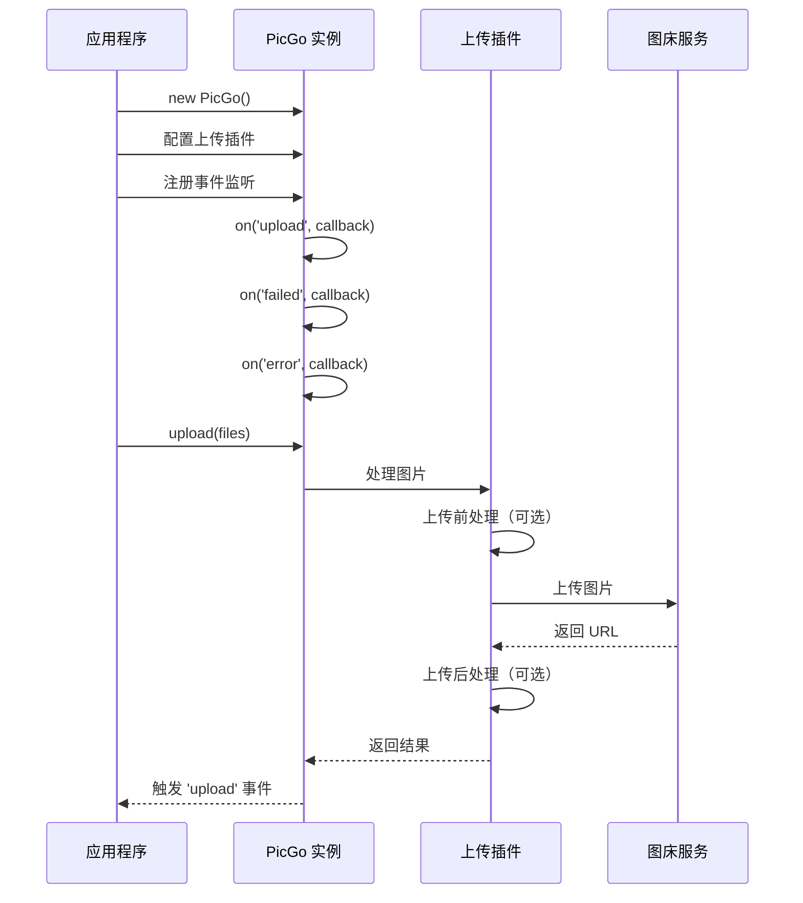

## 引言

由于写博客的时候发现有时候需要上传一些图片，就想着自己搭建一个图床用来保存和使用自己上传的图片,于是我就搜到PicGo

**PicGo** 正是为此而生的图片上传管理工具。官网中有PicGo.exe安装包，是可视化的上传工具，但是我不想下载软件，于是乎，在看了文档之后，发现它有完整的 **Node.js API** 和 **CLI 接口**，可以将图片上传能力无缝集成到任何 Node.js 工作流中。

我想了想了，自己写一个web网站作为我的图片上传工具—— **ImgTools**

本文将基于一个完整的实战项目 —— **ImgTools**，深入讲解如何利用 PicGo 的 API 和 CLI 接口，将图片上传功能集成到构建脚本、编辑器以及各种自动化工作流中。

---

## 一、PicGo 简介

### 1.1 什么是 PicGo

PicGo 是一个用 Node.js 编写的使用简单即可看又可高图片上传管理工具，它支持将图片快速上传到各种图床服务，并返回可访问的图片 URL。

核心特性包括：

- **多平台支持**：支持 SMMS、Imgur、GitHub、阿里云 OSS、腾讯云 COS、七牛云、又拍云等数十种图床
- **插件化架构**：通过插件系统可以轻松扩展新的上传目标
- **CLI 接口**：支持命令行调用，方便集成到自动化脚本
- **API 接口**：提供完整的 Node.js API，可在任何 Node.js 项目中调用
- **剪贴板支持**：直接上传系统剪贴板中的图片

### 1.2 PicGo 的核心架构

PicGo 的核心架构由以下几个关键部分组成：

```
┌─────────────────────────────────────────────┐
│              PicGo 核心                       │
├─────────────────────────────────────────────┤
│  API 层      │  upload() / uploadByBuf()    │
│  事件系统    │  on('upload') / on('failed') │
│  插件管理    │  registerPlugin()            │
├─────────────────────────────────────────────┤
│  插件层      │  上传插件 / 转化插件          │
│              │  上传插件 / 转化插件          │
│              │  上传插件 / 转化插件          │
├─────────────────────────────────────────────┤
│  数据层      │  配置管理 / 上下文传递        │
└─────────────────────────────────────────────┘
```

**核心类 `PicGo`** 提供以下关键方法：

| 方法 | 描述 |
|------|------|
| `upload(paths: string[])` | 上传指定路径的图片文件 |
| `uploadByBuf(buffer: Buffer[])` | 上传 Buffer 数组形式的图片 |
| `upload()` | 上传剪贴板中的第一张图片 |
| `on(event, callback)` | 监听事件（如 `upload`、`failed`、`error`） |
| `publish(ctx)` | 发布处理后的上下文 |

### 1.3 为什么选择 PicGo API

选择 PicGo API 而非直接调用图床 API 的原因：

1. **统一接口**：一个 API 对接多种图床，无需为每个平台编写不同的上传逻辑
2. **插件化处理**：支持上传前处理（压缩、裁剪、格式转换）和上传后处理（链接替换）
3. **配置管理**：内置配置文件管理，支持多平台切换
4. **社区生态**：丰富的插件生态，持续更新维护

---

## 二、环境搭建与基础配置

### 2.1 安装 PicGo

在你的 Node.js 项目中安装 PicGo：

```bash
npm install picgo
```

或者使用 yarn：

```bash
yarn add picgo
```

**版本要求**：建议使用 `picgo@1.5.0` 或更高版本，这些版本提供了更稳定的 API 接口。

在我们的 ImgTools 项目中，`package.json` 中的依赖配置如下：

```json
{
  "devDependencies": {
    "picgo": "^2.0.3"
  }
}
```

### 2.2 初始化 PicGo 实例

在 TypeScript/JavaScript 项目中，你需要如下初始化 PicGo：

```typescript
// @ts-ignore
const { PicGo } = require('picgo')

const picgo = new PicGo()
```

**为什么使用 `require` 而不是 `import`？**

因为 PicGo 使用 CommonJS 模块导出，而许多现代项目使用 ES Modules。使用 `require` 可以避免模块兼容性问题。`@ts-ignore` 注释用于抑制 TypeScript 的类型检查错误。

### 2.3 配置上传插件

在调用上传 API 之前，需要配置 PicGo 使用哪个上传插件。以 GitHub 为例：

```javascript
picgo.gitHub = {
  token: 'ghp_xxxxxxxxxxxxxxxxxxxx',
  repo: 'username/repo',
  path: 'images',
  branch: 'main'
}

// 或者使用 setConfig
picgo.setConfig({
  picGo-BED: 'github',  // 设置默认上传平台
  picGo-GitHub-token: 'ghp_xxxxxxxxxxxxxxxxxxxx',
  picGo-GitHub-repo: 'username/repo',
  picGo-GitHub-path: 'images',
  picGo-GitHub-branch: 'main'
})
```

---

## 三、通过 API 集成图片上传

### 3.1 基础上传流程

PicGo API 的核心上传流程可以用以下流程图表示：



### 3.2 上传指定文件

这是最常用的上传方式。你可以通过传入文件路径数组来指定要上传的图片：

```typescript
import { PicGo } from 'picgo'

const picgo = new PicGo()

// 配置上传插件
picgo.setConfig({
  'picGo-BED': 'github',
  'picGo-GitHub-token': 'your-token',
  'picGo-GitHub-repo': 'username/repo'
})

// 上传指定文件
const files = ['/path/to/image1.jpg', '/path/to/image2.png']
const result = await picgo.upload(files)

console.log(result.output) // 返回的图片 URL 数组
```

在我们的 ImgTools 项目中，`picgo.ts` 工具函数的实现如下：

```typescript
/**
 * PicGo 工具封装（TypeScript）
 * 依赖：picgo (v1.5.0+)
 * 用法示例：
 *   import { upload } from '@/utils/picgo'
 *   await upload(['/path/to/img.jpg']) // 上传指定文件
 *   await upload() // 上传剪贴板第一张图片
 */

// 使用 require 以兼容 picgo 的 CommonJS 导出
// @ts-ignore
const { PicGo } = require('picgo')

type UploadResult = any

/**
 * 上传图片（支持传入文件路径数组，或不传则上传剪贴板第一张图片）
 * @param paths 可选的本地文件路径数组
 */
export async function upload(paths?: string[]): Promise<UploadResult> {
  const picgo = new PicGo()

  return new Promise((resolve, reject) => {
    const onUpload = (ctx: any) => {
      // PicGo 在上传完成会触发 'upload' 事件，回调中包含 ctx
      cleanup()
      resolve(ctx)
    }

    const onFailed = (ctx: any) => {
      cleanup()
      reject(ctx)
    }

    const onError = (err: any) => {
      cleanup()
      reject(err)
    }

    function cleanup() {
      try {
        picgo.removeListener && picgo.removeListener('upload', onUpload)
        picgo.removeListener && picgo.removeListener('failed', onFailed)
        picgo.removeListener && picgo.removeListener('error', onError)
      } catch (e) {
        // ignore
      }
    }

    // 绑定事件
    try {
      picgo.on && picgo.on('upload', onUpload)
      picgo.on && picgo.on('failed', onFailed)
      picgo.on && picgo.on('error', onError)

      // 触发上传：传入数组则按路径上传；不传则尝试上传剪贴板里的第一张图片
      if (Array.isArray(paths) && paths.length > 0) {
        picgo.upload(paths)
      } else {
        picgo.upload()
      }
    } catch (err) {
      cleanup()
      reject(err)
    }
  })
}

export default { upload }
```

**关键要点：**

1. **Promise 封装**：PicGo 的 API 基于事件系统，我们通过 Promise 将其封装为异步函数，方便与现代异步代码风格结合
2. **事件清理**：在上传完成或失败后，及时移除事件监听器，避免内存泄漏
3. **灵活参数**：支持传入文件路径数组，或不传参数（上传剪贴板图片）

### 3.3 上传剪贴板图片

PicGo 的另一个强大功能是直接上传系统剪贴板中的图片。这在编辑器集成中特别有用：

```typescript
// 不传参数，自动上传剪贴板中的第一张图片
const result = await picgo.upload()
```

当不调用 `upload()` 方法传入文件路径时，PicGo 会自动检测系统剪贴板中的图片并进行上传。这在以下场景中非常有用：

- **截图后直接粘贴**：用户截图后按 Ctrl+V，图片自动上传
- **网页图片右键复制**：复制网页图片后，自动上传并获取链接
- **编辑器集成**：在 Markdown 编辑器中粘贴图片，自动上传并插入 Markdown 链接

### 3.4 批量上传

PicGo 支持一次上传多张图片：

```typescript
const files = [
  '/path/to/image1.jpg',
  '/path/to/image2.png',
  '/path/to/image3.webp'
]

const result = await picgo.upload(files)
// result.output 包含所有上传成功的图片 URL
console.log(result.output)
// [
//   'https://example.com/image1.jpg',
//   'https://example.com/image2.png',
//   'https://example.com/image3.webp'
// ]
```

### 3.5 错误处理与事件监听

PicGo 提供了完善的事件系统来处理上传过程中的各种情况：

```typescript
picgo.on('upload', (ctx: any) => {
  console.log('上传成功！', ctx.output)
})

picgo.on('failed', (ctx: any) => {
  console.error('上传失败！', ctx.output)
})

picgo.on('error', (err: any) => {
  console.error('发生错误！', err)
})
```

**常用事件：**

| 事件 | 触发时机 | 回调参数 |
|------|----------|----------|
| `upload` | 上传成功完成 | `ctx`（上下文对象，包含 output） |
| `failed` | 上传失败 | `ctx`（上下文对象，包含错误信息） |
| `error` | 发生异常错误 | `err`（错误对象） |
| `beforePlugin` | 插件处理前 | `(pluginName, ctx)` |
| `afterPlugin` | 插件处理后 | `(pluginName, ctx)` |

---

## 四、CLI 命令行集成

### 4.1 基本 CLI 用法

PicGo 提供了完整的命令行接口，可以在终端中直接使用：

```bash
# 上传指定文件
picgo upload /path/to/image.jpg

# 批量上传
picgo upload /path/to/image1.jpg /path/to/image2.png

# 查看当前配置
picgo config

# 设置上传平台
picgo set upload-bed bed

# 安装插件
picgo install plugin-name

# 更新插件
picgo update plugin-name
```

### 4.2 在构建脚本中使用 CLI

你可以在 npm scripts 或自定义构建脚本中调用 PicGo CLI：

```json
{
  "scripts": {
    "upload:images": "picgo upload ./assets/images/*.jpg",
    "build:docs": "vite build && picgo upload docs/images/*"
  }
}
```

或者在 Node.js 脚本中使用 `child_process`：

```javascript
const { execSync } = require('child_process')

try {
  const result = execSync('picgo upload ./images/*.jpg', {
    encoding: 'utf-8'
  })
  console.log('上传结果：', result)
} catch (error) {
  console.error('上传失败：', error.message)
}
```

### 4.3 在 CI/CD 流水线中集成

在 GitHub Actions 中集成 PicGo 自动上传图片：

```yaml
name: Upload Images

on:
  push:
    paths:
      - 'images/**'

jobs:
  upload:
    runs-on: ubuntu-latest
    steps:
      - uses: actions/checkout@v3
      
      - name: Setup Node.js
        uses: actions/setup-node@v3
        with:
          node-version: '18'
      
      - name: Install PicGo
        run: npm install -g picgo
      
      - name: Configure PicGo
        run: |
          picgo set upload-bed github
          picgo set picGo-GitHub-token ${{ secrets.GITHUB_TOKEN }}
          picgo set picGo-GitHub-repo username/repo
          picgo set picGo-GitHub-path images
          picgo set picGo-GitHub-branch main
      
      - name: Upload Images
        run: picgo upload images/**/*
```

---

## 五、编辑器与工作流集成

### 5.1 在 VS Code 扩展中使用 PicGo

PicGo 的 API 设计使其非常适合集成到 VS Code 扩展中：

```typescript
import * as vscode from 'vscode'
// @ts-ignore
const { PicGo } = require('picgo')

export function activate(context: vscode.ExtensionContext) {
  const picgo = new PicGo()
  
  context.subscriptions.push(vscode.commands.registerCommand(
    'my-extension.uploadImage',
    async () => {
      const editor = vscode.window.activeTextEditor
      if (!editor) return
      
      const selection = editor.selection
      const text = editor.document.getText(selection)
      
      // 处理粘贴的图片
      const result = await picgo.upload()
      const urls = result.output as string[]
      
      // 插入 Markdown 链接
      urls.forEach(url => {
        editor.edit(editBuilder => {
          editBuilder.insert(selection.start, ``)
        })
      })
    }
  ))
}
```

### 5.2 在 Markdown 编辑器中实时上传

结合剪贴板监听和 PicGo API，可以实现实时粘贴上传图片：

```typescript
class PasteUploader {
  private picgo: PicGo
  
  constructor() {
    this.picgo = new PicGo()
    this.configure()
    this.bindEvents()
  }
  
  private configure() {
    this.picgo.setConfig({
      'picGo-BED': 'github',
      'picGo-GitHub-token': process.env.GITHUB_TOKEN!,
      'picGo-GitHub-repo': 'username/repo'
    })
  }
  
  private bindEvents() {
    // 监听粘贴事件
    document.addEventListener('paste', async (event: ClipboardEvent) => {
      const items = event.clipboardData?.items
      if (!items) return
      
      for (const item of items) {
        if (item.type.startsWith('image/')) {
          const blob = item.getAsFile()
          if (blob) {
            const url = await this.uploadBlob(blob)
            this.insertAtCursor(``)
          }
        }
      }
    })
  }
  
  private async uploadBlob(blob: Blob): Promise<string> {
    // 将 Blob 转为临时文件
    const tempPath = await this.saveToTemp(blob)
    // 调用 PicGo 上传
    const result = await this.picgo.upload([tempPath])
    return (result.output as string[])[0]
  }
}
```

### 5.3 Git Hook 自动上传

通过 Git Hook，可以在提交代码时自动上传新增的图片资源：

```bash
#!/bin/bash
# .git/hooks/post-commit

# 获取本次提交新增的图片文件
NEW_IMAGES=$(git diff-tree --no-commit-id --name-only -r HEAD | \
  grep -E '\.(jpg|jpeg|png|gif|webp|svg)$')

if [ -n "$NEW_IMAGES" ]; then
  echo "发现新增图片，开始上传..."
  
  # 使用 PicGo 上传
  for img in $NEW_IMAGES; do
    picgo upload "$img"
  done
  
  echo "图片上传完成！"
fi
```

---

## 六、高级应用场景

### 6.1 自定义上传插件

PicGo 的插件系统非常强大，你可以编写自定义上传插件：

```typescript
const { PicGo } = require('picgo')

const picgo = new PicGo()

// 注册自定义上传插件
picgo.registerUploadPlugin('custom-bed', class CustomUpload {
  constructor (ctx) {
    this.ctx = ctx
  }
  
  async upload (fileArray) {
    // fileArray 格式：
    // [
    //   {
    //     url: 'file:///path/to/image.jpg',
    //     base64Address: 'data:image/jpeg;base64,...',
    //     isImage: true
    //   }
    // ]
    
    const results = await Promise.all(
      fileArray.map(async (file) => {
        // 自定义上传逻辑
        const url = await this.uploadToCustomServer(file)
        return {
          url,
          base64Address: file.base64Address,
          isImage: true
        }
      })
    )
    
    return results
  }
  
  async uploadToCustomServer (file) {
    // 你的自定义上传逻辑
    return 'https://your-server.com/uploaded-image.jpg'
  }
})

// 使用自定义平台
picgo.setConfig('picGo-BED', 'custom-bed')
```

### 6.2 与 GitHub API 结合的实现方案

除了使用 PicGo 的 GitHub 插件，你也可以直接调用 GitHub API 实现图片上传。这种方式提供了更大的灵活性：

```typescript
import axios from 'axios'

interface GitHubConfig {
  token: string
  owner: string
  repo: string
  branch: string
  uploadPath: string
  customDomain?: string
}

interface ImageItem {
  id: string
  url: string
  name: string
  size: number
  uploadDate: string
}

/**
 * 上传文件到 GitHub Repository
 */
export async function uploadToGitHub(
  config: GitHubConfig,
  file: File,
  progress?: (percent: number) => void
): Promise<ImageItem> {
  // 生成文件名：年月日时分秒 + 3 位随机数
  const now = new Date()
  const pad = (n: number, len = 2) => n.toString().padStart(len, '0')
  const fileName = `${now.getFullYear()}${pad(now.getMonth() + 1)}${pad(now.getDate())}${pad(now.getHours())}${pad(now.getMinutes())}${pad(now.getSeconds())}${Math.floor(Math.random() * 900) + 100}${getFileExtension(file.name)}`

  const normalizedPath = (config.uploadPath || '').replace(/^\/+|\/+$/g, '')
  const path = normalizedPath ? `${normalizedPath}/${fileName}` : fileName

  const base64 = await fileToBase64(file)

  try {
    await axios.put(
      `https://api.github.com/repos/${config.owner}/${config.repo}/contents/${encodeURIComponent(path)}`,
      {
        message: `Upload image: ${file.name}`,
        content: base64,
        branch: config.branch
      },
      {
        headers: {
          Authorization: `Bearer ${config.token}`,
          'Content-Type': 'application/json'
        },
        onUploadProgress: (e) => {
          if (progress && e.total) {
            progress(Math.round((e.loaded * 100) / e.total))
          }
        }
      }
    )

    const imageUrl = config.customDomain
      ? `${config.customDomain}/${path}`
      : `https://raw.githubusercontent.com/${config.owner}/${config.repo}/${config.branch}/${path}`

    return {
      id: Date.now().toString(),
      url: imageUrl,
      name: file.name,
      size: file.size,
      uploadDate: new Date().toISOString()
    }
  } catch (err: any) {
    if (err?.message === 'Network Error' || err?.code === 'ERR_NETWORK') {
      throw new Error('Network Error: 无法连接到 GitHub API')
    }
    if (err?.response) {
      throw new Error(`Upload failed: ${err.response.status} ${err.response.data?.message}`)
    }
    throw err
  }
}
```

**直接调用 GitHub API 的优势：**

1. **浏览器端兼容**：可以在前端浏览器中直接调用（需处理 CORS）
2. **进度反馈**：原生支持上传进度回调
3. **错误处理**：更细粒度的错误控制
4. **无需依赖**：不需要安装 PicGo，减少依赖

### 6.3 多平台上传策略

你可以实现多平台上传策略，将图片同时上传到多个平台以实现备份：

```typescript
async function uploadToMultiplePlatforms(files: string[], platforms: string[]) {
  const results: Record<string, string[]> = {}
  
  for (const platform of platforms) {
    try {
      const picgo = new PicGo()
      
      // 配置不同平台
      switch (platform) {
        case 'github':
          picgo.setConfig({
            'picGo-BED': 'github',
            'picGo-GitHub-token': process.env.GITHUB_TOKEN!,
            'picGo-GitHub-repo': 'username/repo'
          })
          break
        case 'aliyun':
          picgo.setConfig({
            'picGo-BED': 'upstream-aliyun-oss',
            'picGo-Aliyun-OSS-bucket': 'my-bucket',
            'picGo-Aliyun-OSS-region': 'oss-cn-shanghai'
          })
          break
      }
      
      const result = await picgo.upload(files)
      results[platform] = result.output as string[]
    } catch (err) {
      console.error(`Platform ${platform} upload failed:`, err)
      results[platform] = []
    }
  }
  
  return results
}
```

---

## 七、完整项目实战

### 7.1 项目概述

**ImgTools** 是一个基于 Vue 3 + TypeScript 的图片管理工具，它结合了 PicGo API 和 GitHub API，提供了完整的图片上传、管理和链接生成功能。

**技术栈：**

| 技术 | 版本 | 用途 |
|------|------|------|
| Vue 3 | 3.5.13 | 前端框架 |
| TypeScript | 5.7.3 | 类型安全 |
| Vite | 6.1.0 | 构建工具 |
| Element Plus | 2.9.1 | UI 组件库 |
| Pinia | 2.3.0 | 状态管理 |
| Axios | 1.7.9 | HTTP 客户端 |
| PicGo | 2.0.3 | 图片上传 |
| Less | 4.2.1 | CSS 预处理器 |

**核心功能：**

- 📤 **多图上传**：支持批量上传、拖拽上传、粘贴上传
- 🖼️ **图片管理**：浏览、搜索、删除已上传图片
- 🔗 **多格式链接**：支持 Markdown、HTML、URL、UBB、自定义格式
- ⚙️ **灵活配置**：可配置 GitHub 仓库参数
- 📱 **响应式设计**：支持桌面端和移动端

### 7.2 核心代码解析

#### 7.2.1 PicGo 工具封装

`src/utils/picgo.ts` 是 PicGo API 的核心封装：

```typescript
// 使用 require 以兼容 picgo 的 CommonJS 导出
// @ts-ignore
const { PicGo } = require('picgo')

export async function upload(paths?: string[]): Promise<UploadResult> {
  const picgo = new PicGo()

  return new Promise((resolve, reject) => {
    const onUpload = (ctx: any) => {
      cleanup()
      resolve(ctx)
    }

    const onFailed = (ctx: any) => {
      cleanup()
      reject(ctx)
    }

    const onError = (err: any) => {
      cleanup()
      reject(err)
    }

    function cleanup() {
      try {
        picgo.removeListener && picgo.removeListener('upload', onUpload)
        picgo.removeListener && picgo.removeListener('failed', onFailed)
        picgo.removeListener && picgo.removeListener('error', onError)
      } catch (e) {
        // ignore
      }
    }

    try {
      picgo.on && picgo.on('upload', onUpload)
      picgo.on && picgo.on('failed', onFailed)
      picgo.on && picgo.on('error', onError)

      if (Array.isArray(paths) && paths.length > 0) {
        picgo.upload(paths)
      } else {
        picgo.upload()
      }
    } catch (err) {
      cleanup()
      reject(err)
    }
  })
}
```

**封装要点：**

1. **Promise 化**：将基于事件的 API 封装为 Promise，便于 async/await 使用
2. **事件清理**：防止内存泄漏
3. **灵活参数**：支持文件路径和剪贴板两种上传方式

#### 7.2.2 GitHub API 直接调用

`src/utils/github.ts` 展示了如何直接调用 GitHub API 上传图片：

```typescript
export async function uploadToGitHub(
  config: GitHubConfig,
  file: File,
  progress?: (percent: number) => void
): Promise<ImageItem> {
  // 生成唯一文件名
  const fileName = generateUniqueFileName(file.name)
  const path = `${config.uploadPath}/${fileName}`
  
  const base64 = await fileToBase64(file)

  await api.put(
    `/repos/${config.owner}/${config.repo}/contents/${encodeURIComponent(path)}`,
    {
      message: `Upload image: ${file.name}`,
      content: base64,
      branch: config.branch
    },
    {
      headers: {
        Authorization: `Bearer ${config.token}`,
        'Content-Type': 'application/json'
      },
      onUploadProgress: (e) => {
        if (progress && e.total) {
          progress(Math.round((e.loaded * 100) / e.total))
        }
      }
    }
  )

  const imageUrl = config.customDomain
    ? `${config.customDomain}/${path}`
    : `https://raw.githubusercontent.com/${config.owner}/${config.repo}/${config.branch}/${path}`

  return {
    id: Date.now().toString(),
    url: imageUrl,
    name: file.name,
    size: file.size,
    uploadDate: new Date().toISOString()
  }
}
```

**直接 API 调用的优势：**

- 浏览器端可直接使用
- 支持上传进度回调
- 更细粒度的错误控制
- 无需安装额外依赖

#### 7.2.3 链接生成工具

`src/utils/links.ts` 提供了多种格式的图片链接生成：

```typescript
export function generateLink(
  image: ImageItem,
  format: string,
  customPattern?: string
): string {
  const url = image.url
  switch (format) {
    case 'markdown':
      return ``
    case 'html':
      return ``
    case 'url':
      return url
    case 'ubb':
      return `[img]${url}[/img]`
    case 'custom':
      return customPattern
        ?.replace('{url}', url)
        .replace('{name}', image.name) || url
    default:
      return ``
  }
}
```

### 7.3 项目结构

```
imgTools/
├── src/
│   ├── utils/
│   │   ├── picgo.ts        # PicGo API 封装
│   │   ├── github.ts       # GitHub API 直接调用
│   │   └── links.ts        # 链接格式生成
│   ├── stores/
│   │   └── index.ts        # Pinia 状态管理
│   ├── views/
│   │   ├── Home.vue        # 上传页面
│   │   ├── Album.vue       # 相册管理
│   │   └── Settings.vue    # 设置页面
│   ├── layouts/
│   │   └── default.vue     # 默认布局
│   ├── router/
│   │   └── index.ts        # 路由配置
│   ├── styles/
│   │   ├── global.less     # 全局样式
│   │   └── variables.less  # Less 变量
│   ├── App.vue             # 根组件
│   └── main.ts             # 入口文件
├── package.json            # 依赖配置
├── vite.config.ts          # Vite 配置
└── tsconfig.json           # TypeScript 配置
```

---

## 八、最佳实践与性能优化

### 8.1 错误处理最佳实践

```typescript
try {
  const result = await picgo.upload(files)
  console.log('上传成功:', result.output)
} catch (err) {
  if (err.code === 'PLUGIN_UPLOAD_ERROR') {
    // 上传插件错误
    console.error('上传失败:', err.message)
  } else if (err.code === 'CONFIG_NOT_FOUND') {
    // 配置缺失
    console.error('请检查 PicGo 配置')
  } else {
    // 其他错误
    console.error('未知错误:', err)
  }
}
```

### 8.2 性能优化建议

1. **复用 PicGo 实例**：避免频繁创建新实例

```typescript
// 推荐：复用实例
const picgo = new PicGo()
// 多次调用 upload
await picgo.upload(files1)
await picgo.upload(files2)
```

2. **批量上传**：将多张图片一起上传，减少网络请求次数

3. **图片压缩**：在上传前使用插件对图片进行压缩

```typescript
picgo.registerTransformPlugin('compress', class Compress {
  async transform (file) {
    // 使用 sharp 或其他库压缩图片
    return compressedBuffer
  }
})
```

### 8.3 安全注意事项

1. **Token 安全**：不要将 GitHub Token 硬编码在代码中，使用环境变量

```typescript
const token = process.env.GITHUB_TOKEN
if (!token) {
  throw new Error('GITHUB_TOKEN not set')
}
```

2. **环境变量管理**：使用 `.env` 文件管理敏感信息

```bash
# .env
GITHUB_TOKEN=ghp_xxxxxxxxxxxxxxxxxxxx
GITHUB_REPO=username/repo
```

3. **生产环境隔离**：开发环境和生产环境使用不同的配置

---

## 结语

通过本文的详细介绍，你应该已经掌握了：

1. **PicGo API 的基础用法**：初始化、配置、上传
2. **CLI 命令行集成**：在脚本和 CI/CD 中使用 PicGo
3. **编辑器工作流集成**：在 VS Code 扩展、Markdown 编辑器中实时上传
4. **高级应用场景**：自定义插件、多平台上传、与 GitHub API 结合
5. **完整项目实战**：基于 ImgTools 项目的代码解析

PicGo 不仅仅是一个图片上传工具，更是一个强大的图片处理框架。通过其灵活的 API 设计和插件系统，你可以将图片上传能力无缝集成到任何 Node.js 工作流中。

无论是构建自动化脚本、开发编辑器扩展，还是搭建自己的图片管理工具，PicGo 都是你值得信赖的选择。

---

**参考资料：**

- [PicGo 官方文档](https://picgo.github.io/PicGo-Doc/)
- [PicGo GitHub 仓库](https://github.com/Molunerfinn/PicGo)
- [GitHub API 文档](https://docs.github.com/en/rest)
- [本项目 - ImgTools](https://github.com/drda-x/imgTools)

---

*本文基于 ImgTools 项目实战编写，项目地址：[imgTools](https://drda-x.github.io/imgTools/)*
